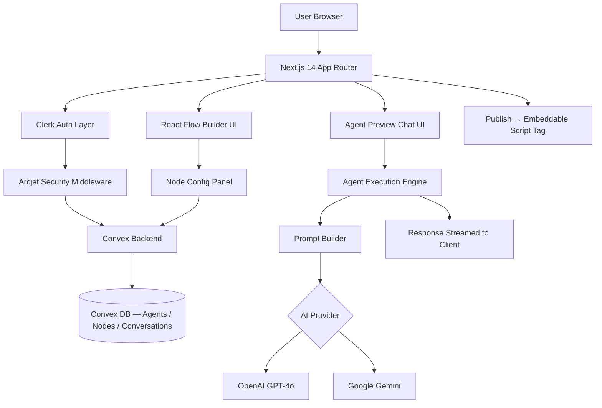
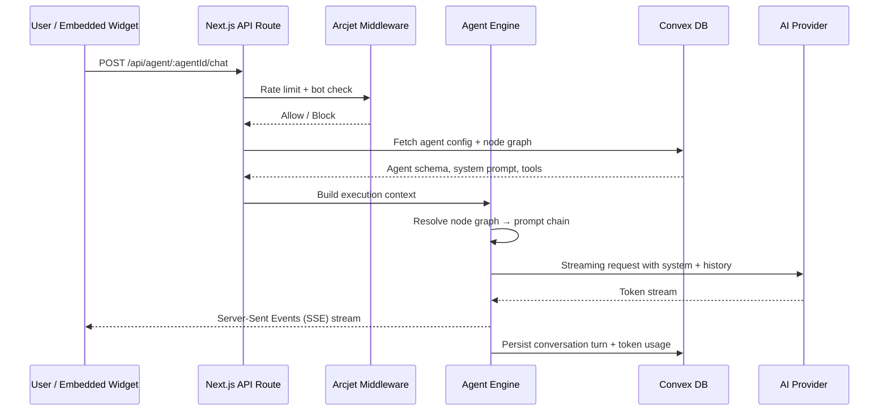

# Agentify — AI Agent Builder Platform

> A visual, full-stack SaaS platform for building, configuring, and deploying AI agents — without writing LLM logic from scratch.
> Users drag-and-drop agent flows, test them in a live chat UI, then publish and embed them anywhere with a single script tag.

> **Note:** Full source code is private due to client confidentiality.
> This repository contains architecture documentation, design decisions, and proof-of-concept implementations demonstrating core system patterns.

---

## Architecture Overview

### System Architecture



### Agent Execution Flow



### Key Components

| Component | Responsibility |
|---|---|
| **React Flow Builder** | Visual node graph editor — users wire agent logic without code |
| **Agent Execution Engine** | Traverses the node graph, resolves prompt chains, calls AI providers |
| **Convex Backend** | Real-time reactive DB + serverless functions — no separate REST API needed |
| **Arcjet Middleware** | Per-user rate limiting, bot detection, abuse protection on all agent endpoints |
| **Publish Layer** | Serializes agent config → generates embeddable `<script>` tag with isolated iframe widget |

---

## Tech Stack & Why

### Next.js 14 (App Router) over alternatives
- **App Router** enables React Server Components for fast initial load — the agent builder canvas is heavy client-side JS, RSC means the shell loads instantly
- **Streaming** support via `Response` + `ReadableStream` maps perfectly to token-by-token LLM output
- Considered: plain React SPA — rejected because SEO matters for the public agent embed pages and we'd need a separate API server

### Convex over Supabase / PlanetScale
- **Real-time reactivity out of the box** — when a collaborator updates an agent node, all editors see it instantly without polling
- Functions live co-located with schema — no ORM layer, no migration drift
- Considered: Supabase — good choice but real-time subscriptions require more wiring; Convex's reactive model was a better fit for a collaborative builder

### React Flow over building custom canvas
- Battle-tested graph editor with zoom, pan, custom node types, edge routing
- Handles the hard parts: hit testing, viewport transforms, minimap
- We own the node data model — React Flow is only the rendering layer, not the source of truth

### Arcjet over custom rate limiting
- Bot detection, rate limiting, email validation in one middleware call — 2 lines vs 200
- Runs at the Edge before any business logic — malicious requests never reach the DB
- Considered: Upstash Redis + custom middleware — more control but 3x the implementation surface

### Clerk over Auth.js / custom auth
- Social + email/password + magic link out of the box
- JWT claims carry user org/plan tier — the agent execution engine reads these to enforce usage limits without a DB lookup
- Considered: NextAuth — rejected because we needed organization-level access control and Clerk's `orgId` in JWT was the cleanest path

### OpenAI / Gemini SDK (multi-provider) over single-provider lock-in
- Agent configs store `provider` + `model` as fields — swapping models is a data change, not a code change
- Lets users choose GPT-4o for reasoning-heavy agents, Gemini Flash for speed/cost-sensitive agents
- Abstraction layer means adding Anthropic Claude took ~40 lines

---

## Performance Considerations

### Streaming responses
All agent chat responses use **Server-Sent Events (SSE)** — tokens stream to the client as they're generated. Time-to-first-token is typically under 400ms. This was non-negotiable UX: waiting 8 seconds for a complete response kills perceived performance.

### Convex real-time sync
Convex's reactive queries mean the React Flow canvas updates in real-time across sessions. No polling, no websocket management — the framework handles it. For large agent graphs (50+ nodes), we implemented **lazy node loading** — only visible viewport nodes subscribe to live updates.

### Token budget management
Each agent config includes a `maxTokens` and `contextWindow` field. The execution engine:
1. Trims conversation history to fit the context window (sliding window, preserving system prompt + last N turns)
2. Estimates token count before sending (via `tiktoken`) to avoid mid-stream truncation
3. Logs actual usage per turn to Convex for billing/metering

### Arcjet at the Edge
Security middleware runs at Vercel Edge — before the request hits any serverless function. Blocked requests cost ~1ms and zero DB reads. At scale this matters: a basic DDoS attempt that would hammer the DB gets stopped at the CDN layer.

---

## Security Design

### Authentication
- **Clerk** handles all auth — JWT tokens signed with RS256, verified on every API route via `auth()` helper
- JWT claims include `userId`, `orgId`, `plan` tier — no session DB lookup needed for authorization decisions
- Embedded agent widgets use **public API keys** scoped to a single `agentId` — no user credentials ever leave the platform

### Arcjet Protection Layers
```
Request → [1] Bot detection → [2] Rate limit (per userId/IP) → [3] Email validation (signup) → Handler
```
- Agents on free tier: 50 requests/day per user
- Abuse attempts: automatic IP block + alert logged to Convex

### Input Validation
- All user inputs (agent name, system prompt, node config) validated with **Zod** schemas before hitting Convex mutations
- System prompts are stored and displayed as plaintext — never interpolated into HTML without sanitization (XSS prevention)
- LLM inputs: user messages are wrapped in a structured prompt template that separates system instructions from user content — prompt injection mitigation

### Secret Management
- AI provider API keys stored in **Vercel environment variables** — never in DB, never in client bundle
- Convex environment config for server-side secrets — separate from client-side public config
- `next.config.js` explicitly blocks all `OPENAI_*` / `CLERK_SECRET_*` env vars from client bundle via `serverRuntimeConfig`

---

## Key Engineering Decisions

### 1. Node graph as data, not code
**Decision:** Agent flows are stored as a serializable JSON graph (`nodes[]` + `edges[]`) in Convex — not as generated code.

**Why:** Storing as code (e.g., generating a Python function from the graph) would make the agent immutable after publish. Storing as data means agents can be edited live, versioned, and rolled back. The execution engine interprets the graph at runtime.

**Tradeoff:** Slightly slower execution (graph traversal on each request) vs. the flexibility of hot-editing published agents. At our scale, the traversal adds ~5ms — acceptable.

**At 10x scale:** Compile the graph to an optimized execution plan on publish, cache it in Redis. Invalidate on edit. Zero runtime traversal cost.

### 2. Convex for everything vs. dedicated API layer
**Decision:** Use Convex mutations/queries as the entire backend — no separate Express/FastAPI server.

**Why:** For a v1 SaaS, the operational overhead of maintaining a separate API service wasn't justified. Convex's TypeScript-native functions, real-time subscriptions, and built-in auth integration let us ship the full platform faster.

**Tradeoff:** Less control over infrastructure, vendor dependency on Convex.

**At 10x scale:** Extract the agent execution engine into a dedicated service (FastAPI or Node worker pool) with a queue (BullMQ/SQS) for async agent runs. Convex remains the DB and real-time layer, but heavy compute moves out.

### 3. SSE over WebSockets for streaming
**Decision:** Used Server-Sent Events for token streaming instead of WebSockets.

**Why:** SSE is unidirectional (server → client), which matches the LLM streaming pattern exactly. No need for bidirectional comms. SSE works over standard HTTP/2, plays nicely with Vercel Edge Functions, and requires zero connection management on the client.

**Tradeoff:** Can't push server-initiated updates mid-conversation (e.g., tool call progress) without a separate channel.

**At 10x scale:** Move to WebSockets if agents gain long-running tool execution (web search, code execution) that needs bidirectional status updates.

---

## Local Development Setup (POC)

```bash
# Clone the proof-of-concept
git clone https://github.com/yourhandle/agentify-demo
cd agentify-demo

# Install dependencies
npm install

# Set environment variables (see .env.example)
cp .env.example .env.local

# Run Convex dev server
npx convex dev

# Run Next.js dev server
npm run dev
```

### Environment Variables

```bash
# .env.example
NEXT_PUBLIC_CLERK_PUBLISHABLE_KEY=pk_test_...
CLERK_SECRET_KEY=sk_test_...
NEXT_PUBLIC_CONVEX_URL=https://your-deployment.convex.cloud
ARCJET_KEY=ajkey_...
OPENAI_API_KEY=sk-...
GOOGLE_GENERATIVE_AI_API_KEY=...
```

---

## Repository Structure

```
agentify-demo/
├── README.md                    # This file
├── schema.ts                    # Convex data model
├── openapi.yaml                 # Agent execution API contract
├── agent-prompt-template.md     # LLM prompt engineering patterns
├── agent.test.ts                # Unit tests — core execution logic
└── .env.example                 # Environment variable reference
```

---

## Status

**Proof of concept** — core agent execution engine and data model demonstrated here.
Full platform code is private. Architecture and design decisions documented above reflect the production system.

---

## Contact

Built by [Your Name] · [your@email.com] · [linkedin.com/in/yourhandle]
